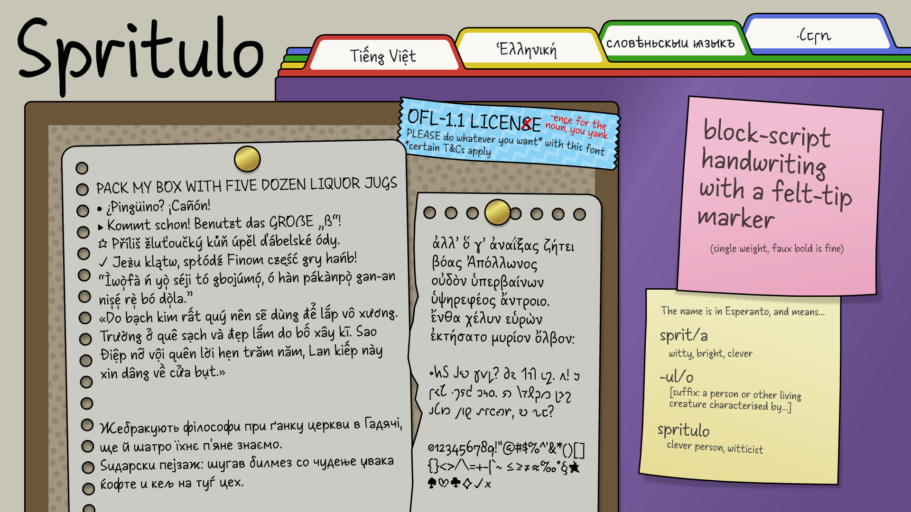
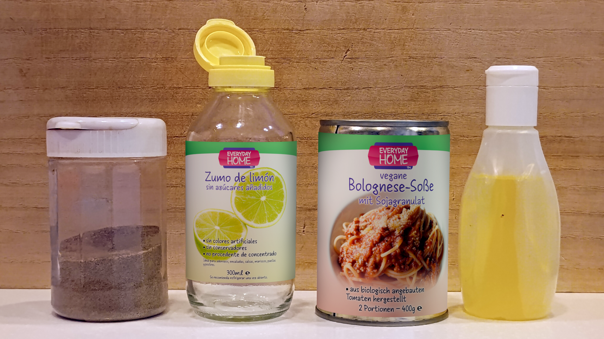
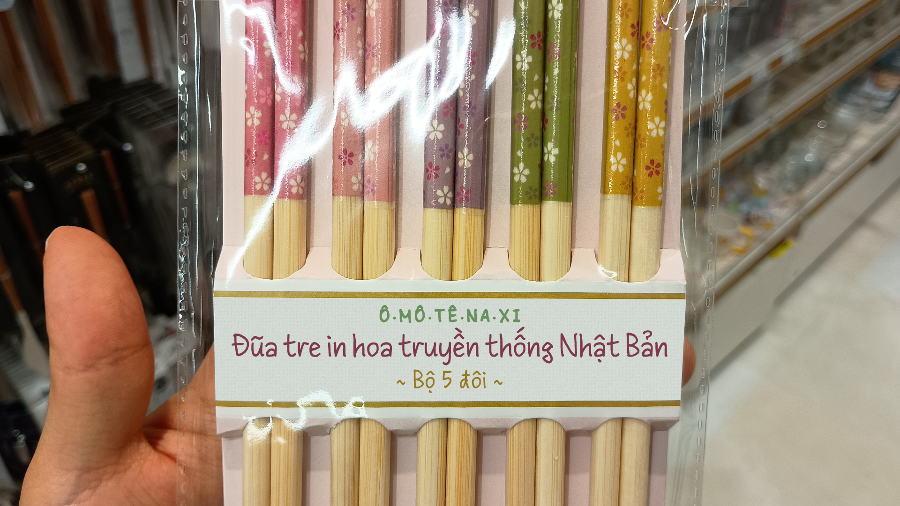
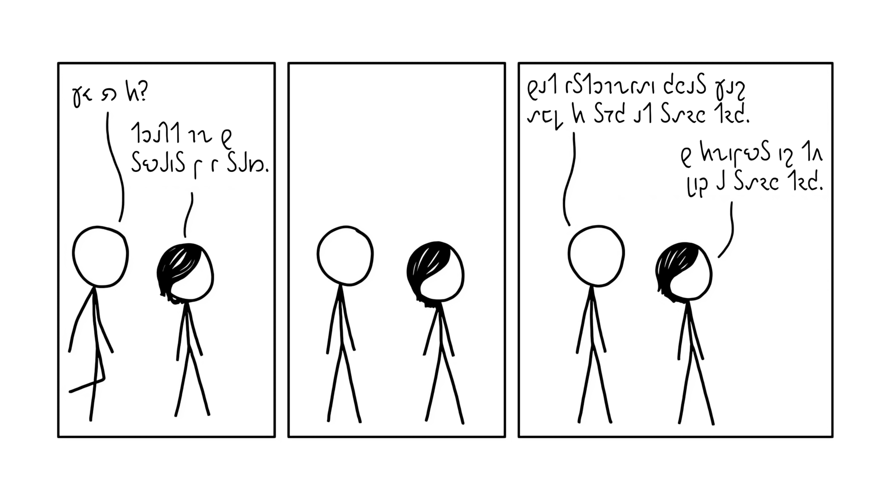
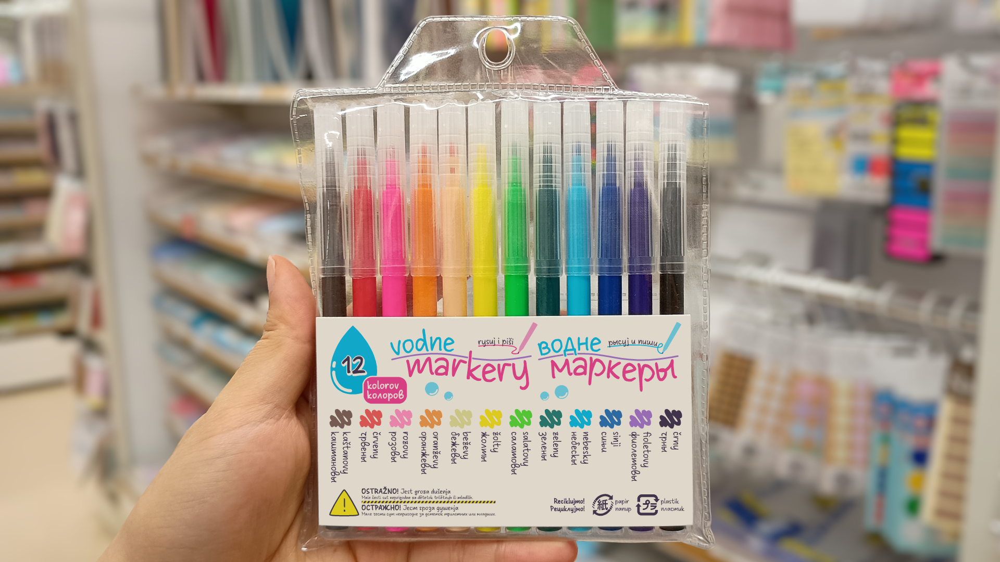
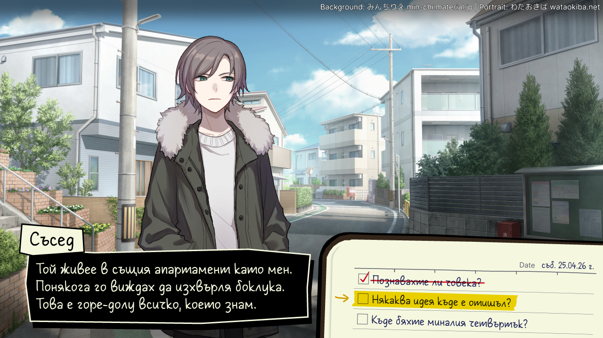
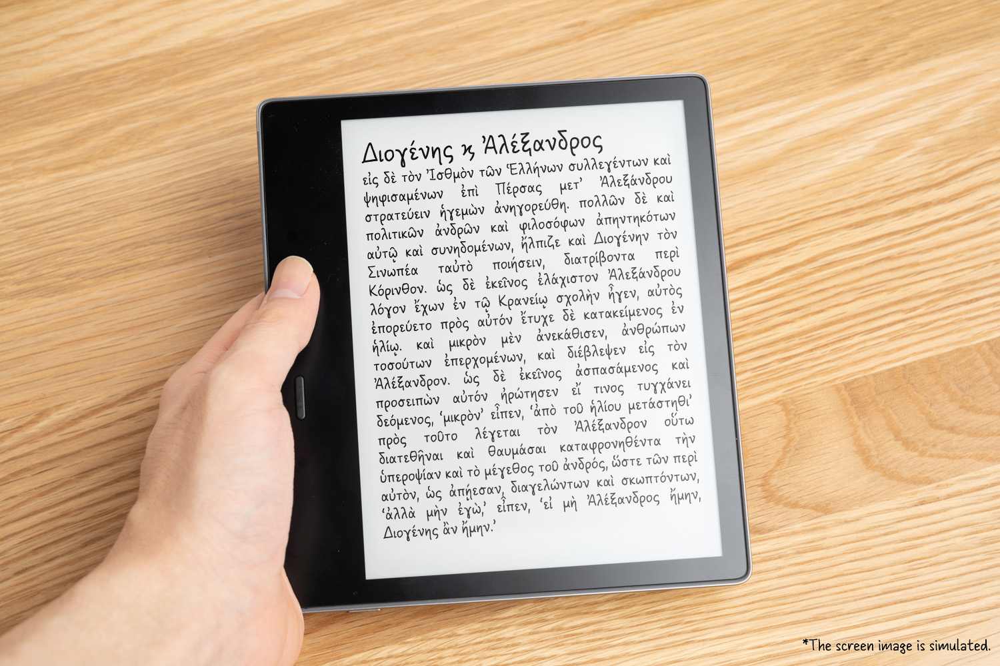
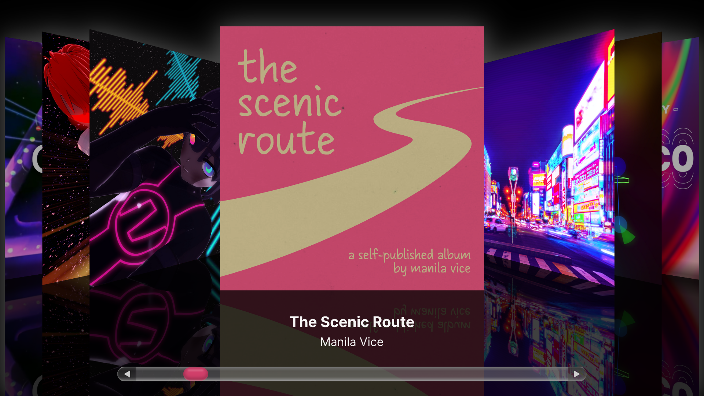

# Spritulo

## About

**Spritulo** ([English pronunciation](https://en.wikipedia.org/wiki/Help:Pronunciation_respelling_key) *sprit-OO-loh*; [Esperanto pronunciation](https://en.wikipedia.org/wiki/Help:IPA/Esperanto) \[spritˈulo\]) is a block-script handwriting font with massive multilingual support spanning Latin, Greek, and Cyrillic. It started as a project to create a modern handwriting font for Ancient Greek, but has since expanded to include a diverse character set including Vietnamese and Bulgarian Cyrillic. It is based on the handwriting of the designer using a felt-tip pen, with some creative liberties and beautification added in.

The Cyrillic letterforms blend block-script versions with some cursive features.

Stylistic alternates exist for more casual handwriting forms in Cyrillic and Greek.

## Examples

### Specimens

> Desk – multiple languages

### Mockups

> ▲ Kitchen – Spanish and German

> ▲ Chopsticks – Vietnamese  
> \* Note that faux bold will look bad on letters with diacritics.

> ▲ Comic – English (Shavian Alphabet)  
> [*xkcd* #1248](https://www.explainxkcd.com/wiki/index.php/1248:_Sphere) by Randall Munroe is licensed under Creative Commons

> ▲ Markers – Interslavic (Latin and Cyrillic)

> ▲ Detective game – Bulgarian

> ▲ Book – Dutch

> ▲ E-Reader – Ancient Greek (Polytonic Greek)

> ▲ iTunes – English

## Name

*Spritulo* is Esperanto for “witticist” or “clever guy”, from *sprit(a)* “witty” and *-ulo* “[person characterized by said feature]”.

Its Esperanto name continues the theme from my previous Google Fonts project, [Orelega One](https://fonts.google.com/specimen/Orelega+One); *Orelega* is Esperanto for “big-eared”.

## Known issues

* (The version of) FontForge (that runs fine on my PC) can only export a broken features.fea file. Loading it on FontForge removes all OpenType features except kerning. Thanks for nothing, FontForge. The latest project file is still the FontForge project (Spritulo-Regular.sfd).

## Features

### Writing system support

Latin (Vietnamese), IPA, Greek (Polytonic), Cyrillic (Old Church Slavonic), Shavian

### Language support

**116 languages** detected by [FontDrop!](https://fontdrop.info), which are:

> Belarusian, Bosnian, Bulgarian, Chechen, Macedonian, Ossetic, Russian, Serbian, Ukrainian, Greek, Afrikaans, Akan, Albanian, Asu, Bafia, Basque, Bemba, Bena, Breton, Catalan, Chiga, Colognian, Cornish, Croatian, Czech, Danish, Dutch, Embu, English, Esperanto, Estonian, Ewondo, Faroese, Filipino, Finnish, French, Friulian, Galician, Ganda, German, Gusii, Hawaiian, Hungarian, Icelandic, Inari Sami, Indonesian, Irish, Italian, Jola-Fonyi, Kabuverdianu, Kalaallisut, Kalenjin, Kamba, Kikuyu, Kinyarwanda, Lakota, Latvian, Lingala, Lithuanian, Lower Sorbian, Luba-Katanga, Luo, Luxembourgish, Luyia, Machame, Makhuwa-Meetto, Makonde, Malagasy, Maltese, Manx, Meru, Metaʼ, Morisyen, Northern Sami, North Ndebele, Norwegian Bokmål, Norwegian Nynorsk, Nyankole, Oromo, Polish, Portuguese, Quechua, Romanian, Romansh, Rombo, Rundi, Rwa, Samburu, Sango, Sangu, Scottish Gaelic, Sena, Serbian, Shambala, Shona, Slovak, Slovenian, Soga, Somali, Spanish, Swahili, Swedish, Swiss German, Taita, Teso, Tongan, Turkish, Upper Sorbian, Uzbek (Latin), Vietnamese, Volapük, Vunjo, Walser, Western Frisian, Yangben, Zulu

### Odds & ends

* **Arrows:** ← → ↑ ↓ ↔ ↕ ↵ ⇧ ⇪
* **Math symbols:** × ÷ ¬ ∀ ∃ ∅ ∇ ∈ ∌ ∛ ∝ ∞ ∧ ∪ ≈ ≟ ≠ ≡ ≥ ⊂ ⊅ ⊇ ⊈ etc.
* **Currency symbols**: $ ¢ £ ¥ € ₯ ₴ ₽
* **Card suits**: ♠ ♥ ♦ ♣ ♤ ♡ ♢ ♧ 
* **Symbols and dingbats**: № ★ ☆ ✓ ✔ ✕ ✖ ✗ ✘
* **Musical symbols**: ♩ ♪ ♫ ♬ ♭ ♮ ♯, and 24-tone accidentals demiflat, sesquiflat, demisharp, and sesquisharp, both in the PUA according to SMuFL encoding, and the provisional Unicode encoding
* **Obscure punctuation**: ⸘ ‽ ⸨ ⸩
* **Volapük umlauts**: Ꞛ ꞛ Ꞝ ꞝ Ꞟ ꞟ
* **Precomposed Roman numerals:** Ⅰ Ⅱ Ⅲ Ⅳ Ⅴ Ⅵ Ⅶ Ⅷ Ⅸ Ⅹ Ⅺ Ⅻ Ⅼ Ⅽ Ⅾ Ⅿ ↀ ↁ ↂ ↇ ↈ

### OpenType summary

* `case` Case-sensitive forms
* `dlig` Discretionary ligatures
* `liga` Ligatures
* `lnum` Lining numerals (Defaults are old-style)
* `locl` Localized forms (Romanian/Moldovan, and Bulgarian)
* `locl` Localized ligatures (Dutch/Flemish)
* `ss01`-`ss02` 2 stylistic sets
* `kern` Kerning
* `ordn` Ordinals (º and ª only)
* `sups` Superscript
* `cv01`-`cv18` 18 character variants

For details on OpenType features, such as cursive-style Cyrillic and Greek, and alternate numerals, please read [opentype.md](documentation/opentype.md).

### Ligatures

**Unicode:** IJ, ij, ff, fi, fl, ffi, ffl

**Non-Unicode (Latin):** fj, ft

**Non-Unicode (IPA):** several tone contours

**Non-Unicode (Dutch only):** IJ with acute accent, ij with acute accent

**Non-Unicode (Shavian alphabet):** 𐑦𐑙 /ɪŋ/, 𐑩𐑯 /ən/, 𐑾𐑯 /iən/

## About

UkiyoMoji Fonts is a label under which I (Haley Wakamatsu) release fonts, most of them available for free.

## Building

Since this repository template does not support FontForge, fonts are built manually.

## Changelog

**(future release). Spritulo Version 1.00**
- MAJOR Renamed from Stampatello Faceto to Spritulo to prepare for potentially breaking changes.
- MAJOR Added Greek handwritten forms.
- MAJOR Added the IPA tricolon and half-tricolon (crucial for vowel length marking).
- MAJOR Re-implemented OpenType substitutions.
- MAJOR Added more Cyrillic letters, like for Kazakh.
- MAJOR Added unique “seriffed” glyphs for uppercase Roman numerals.
- MINOR Added the alternate Volapük umlauts (ꞚꞛꞜꞝꞞꞟ U+A79A~A79F).
- MINOR Tweaked Vietnamese letterforms.
- MINOR Added more combining diacritics for IPA transcriptions.
- MINOR Added diacritic anchors to more letters for IPA transcription.
- MINOR Added characters for Old Church Slavonic.
- MINOR Added arrows and more math symbols.
- MINOR Added musical symbols and card suits.
- MINOR Added more kerning.

**05 Dec 2023. Stampatello Faceto Version 0.02**
- MINOR Added some kerning.
- MINOR Added certain Latin letters: capital schwa, capital turned E, capital ezh.
- MINOR Added certain Cyrillic letters: capital and lowercase barred O, Cyrillic equivalents of the Latin additions, and lots of letters plus one diacritic.

**10 Nov 2023. Stampatello Faceto Version 0.01**
- MAJOR Initial upload.

## License

This Font Software is licensed under the SIL Open Font License, Version 1.1.
This license is available with a FAQ at
https://scripts.sil.org/OFL

## Repository Layout

This font repository structure is inspired by [Unified Font Repository v0.3](https://github.com/unified-font-repository/Unified-Font-Repository), modified for the Google Fonts workflow.
