*note:* For some reason, the current SFDIR file won't build. `cv04` through `cv18`, `ss01`, `ss02`, and `liga NLD` are not available yet, and `liga` vs. `dlig` have not been separated.

# OpenType features

Stampatello Faceto’s default Cyrillic portion mixes cursive-style simplifications, like the ⟨u⟩-like shapes for ⟨и ц ш щ⟩, with block script features, like ⟨т⟩ *not* looking like ⟨m⟩. You can enable all cursive-like features using Style Set 1.

Stampatello Faceto’s default Greek portion is intended for use as phonetic and mathematical symbols. If you want a more handwriting-style look, you can enable Style Set 2, or toggle individual features as you wish. If the Bulgarian locale is active for the font, these features are activated for you automatically.

* `cv01` — single-storey ⟨a⟩ (ɑ), Cyrillic ⟨а⟩, and Greek ⟨α⟩

* `cv02` — single-storey ⟨g⟩ (ɡ), cursive Cyrillic ⟨д⟩ (same shape as single-storey ⟨g⟩), cursive Cyrillic ⟨Д⟩ (same shape as ⟨D⟩), and cursive Greek ⟨Δ⟩ (also same shape as ⟨D⟩)

* `cv03` — single-stroke Greek ⟨Ω⟩
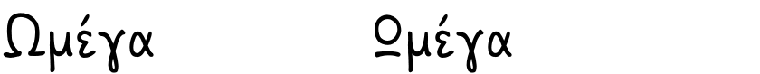

* `cv04` — closed ⟨β⟩

* `cv05` — round ⟨γ⟩ (looks like ⟨𐑣⟩, but fatter)
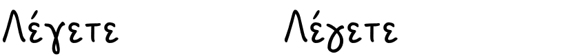

* `cv06` — round ⟨δ⟩

* `cv07` — round Greek ⟨Ε⟩

* `cv08` — faster ⟨ζ⟩
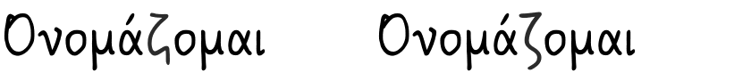

* `cv09` — non-descending ⟨η⟩ (same shape as ⟨n⟩)
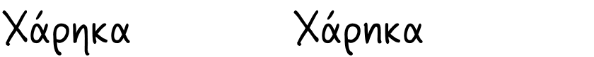

* `cv10` — round ⟨Θ⟩ and ⟨θ⟩
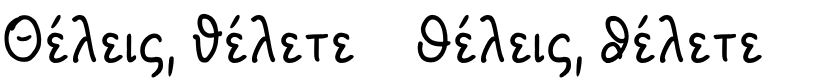

* `cv11` — cursive ⟨κ⟩ (same shape as ⟨u⟩)

* `cv12` — single-stroke ⟨λ⟩

* `cv13` — round-topped ⟨ξ⟩

* `cv14` — round ⟨Π⟩ and ⟨π⟩
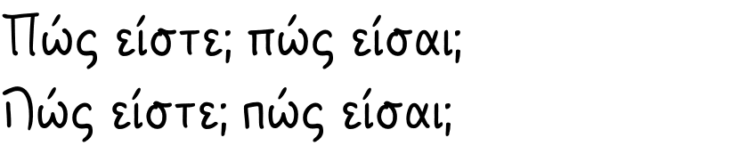

* `cv15` — round ⟨Σ⟩, ⟨σ⟩, and ⟨ς⟩
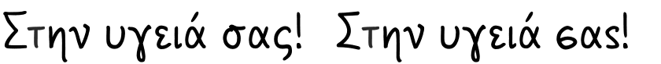

* `cv16` — round ⟨τ⟩

* `cv17` — cursive ⟨Φ⟩ and ⟨φ⟩

* `cv18` — two-pronged ⟨Ψ⟩ (looks like ⟨Ч⟩) and ⟨ψ⟩ (looks like ⟨ɥ⟩)
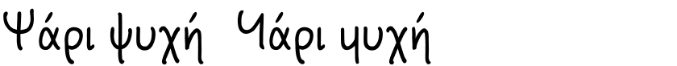

* `ss01` — Cyrillic cursive (automatically applied in Bulgarian locale)
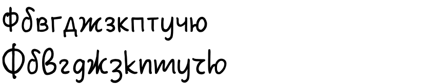

* `ss02` — Greek cursive (applies the Greek portion of `cv01`, `cv04` ~ `cv10`, `cv12` ~ `cv18`)
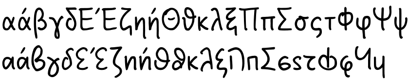

* `lnum` — lining numerals (old-style by default)
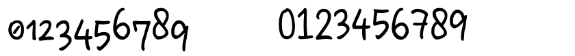

* `locl` (`ROM`, `MOL`) — replace ⟨ş, ţ⟩ (with cedilla) with ⟨ș, ț⟩ (with comma accent)
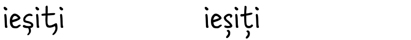

* `locl` (`BGR`) — copy of `ss01`

* `liga` (`NLD`, `FLE`) — ligatures for ⟨IJ⟩, ⟨ij⟩, ⟨ÍJ⟩, and ⟨íj⟩ (The latter two will put the acute accent on both vertical strokes)
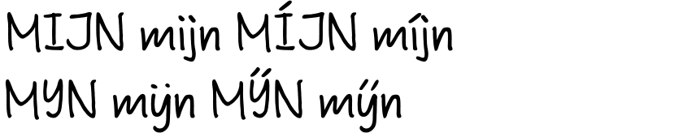

* `liga` — default ligatures for ⟨fi⟩, ⟨fj⟩, and ⟨ft⟩
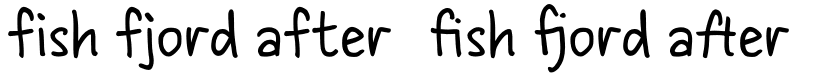

* `dlig` — optional ligatures for ⟨ff⟩, ⟨ffi⟩, ⟨ffl⟩, and ⟨fl⟩ (They exist as Unicode compatibility codepoints, but they aren’t enabled by default because they don't flow well in my handwriting.)
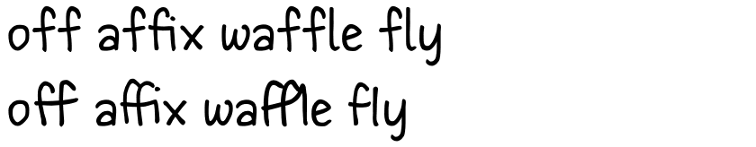

* `case` — all-caps positioning for parentheses/brackets, hyphens, dashes, and middle dot
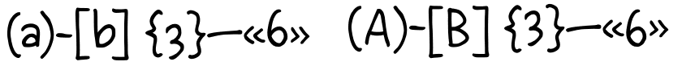